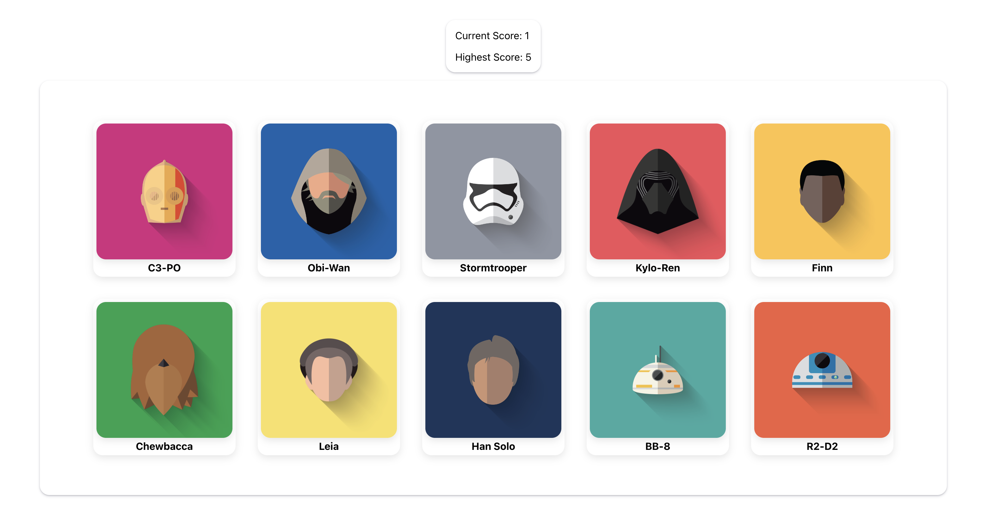

# odin-weather-app

### Memory Card Game

## Access the page [here](https://benjamin-albarzendji.github.io/odin-memory-card/)

### Description

My second project using ReactJS! This time utilizing Hooks to create a memory card game with Star wars characters.

### Project Technologies:

- CSS
- HTML
- JavaScript
- ReactJS
- ReactJS Hooks
- Webpack
